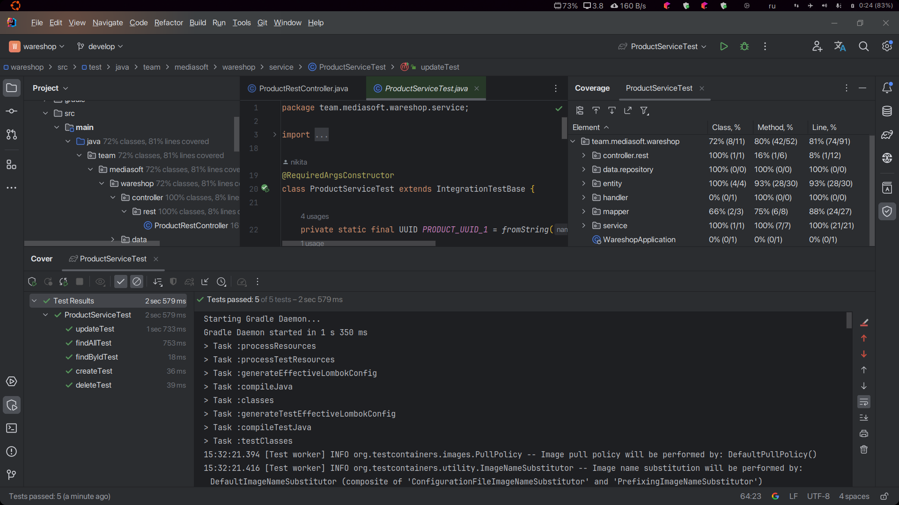

# Тестовое задание для Академии Разработки MEDIASOFT

### Тестовое задание:

Создать CRUD-приложение для склада товаров.
Технологии: Spring-Boot, Hibernate, PostgreSQL.
Хранимая сущность товара должна содержать следующие поля:  название, артикул (уникальное), описание, категория товара,
цена, количество, дата и время последнего изменения количества, дата создания. Настройка авторизации в проекте не
требуется.

# Cтек проекта

- SpringBoot
- Java 17
- Hibernate
- Liquibase
- Stream API
- jUnit
- TestContainers(Postgresql)
- Docker
- Springdoc-openapi(Swagger-ui)

# Docker

Build gradle:  
`gradlew clean build`  
Build project image with docker:  
`docker image build ./ -t nikitin/backend-docker`  
Build and running the docker container container with an images:   
`docker compose up --build`  
Stopping a docker container:  
`docker stop wareshop pgserver`

# Swagger

- Страница с эндпоинтами
  

# Postman

- Получение всех продуктов
  

- Получение продукта по идентификатору(UUID)
  

- Создание продукта
  

- Обновление продукта
  

- Удаление продукта по идентификатору(UUID)
  

# Тесты

